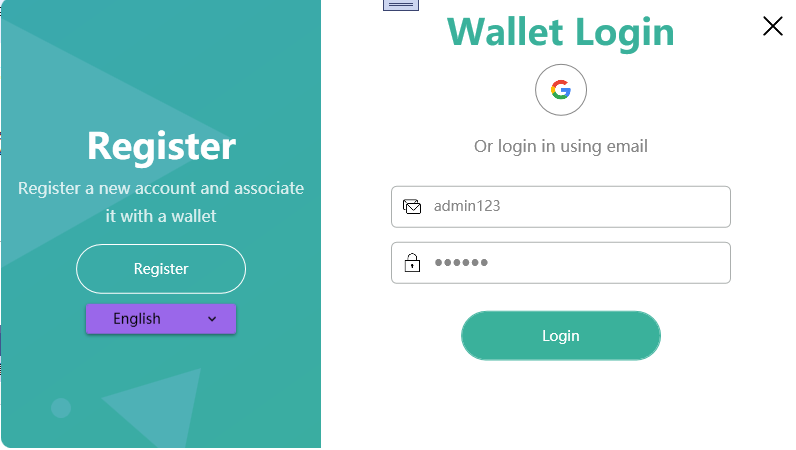
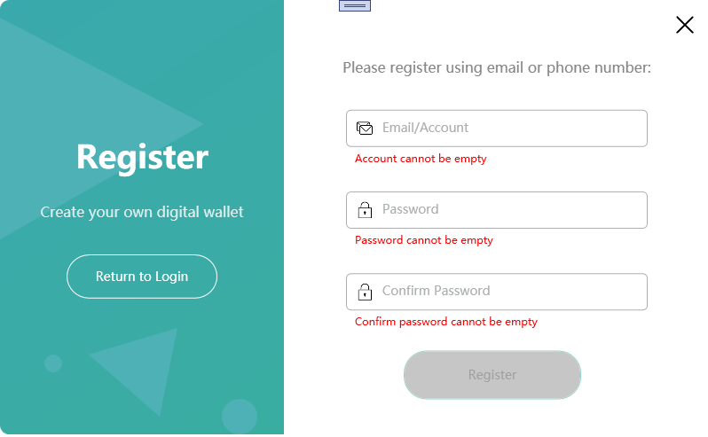
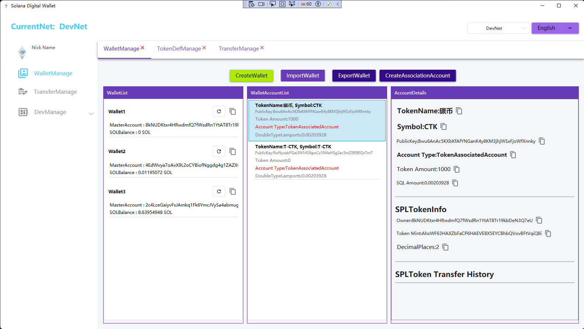
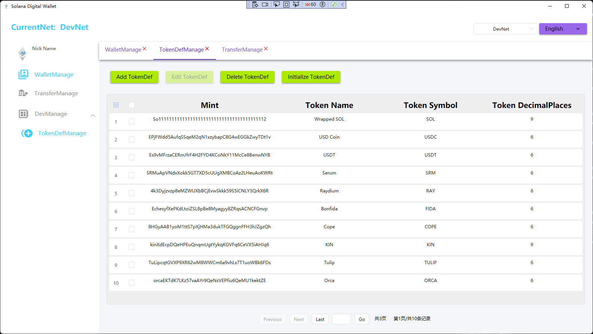
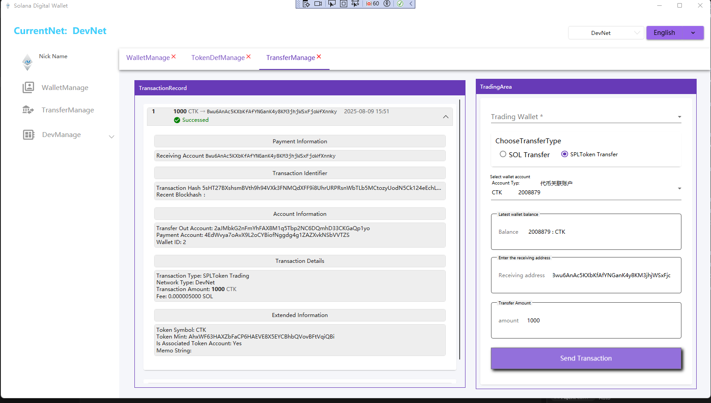

# YC.Wallet - 企业级Solana桌面钱包

[](https://dotnet.microsoft.com/)
[](https://materialdesigninxaml.net/)
[](https://solana.com/)
[](LICENSE)

> 首个企业级Solana桌面钱包，专为C#开发者打造，支持多语言、Google OAuth登录、SPL代币管理等企业级功能。

## 📖 文档导航

- [English Documentation](README.md)
- [English User Manual](document/User-Manual-EN.md)
- [中文用户手册](document/用户使用说明书.md)
- [youtube Video](https://www.youtube.com/watch?v=js8nmaekmmQ)

## 📸 界面预览

### 登录与注册
<div align="center">


</div>

### 钱包管理
<div align="center">

</div>

### 代币管理
<div align="center">

</div>

### 交易管理
<div align="center">

</div>

## 🌟 项目特色

### 🚀 技术优势
- **首个C#桌面钱包** - 填补Solana生态桌面端空白
- **企业级安全** - 适合企业用户和机构使用
- **多语言支持** - 完整的中英文国际化解决方案
- **Google OAuth** - 创新的用户体验设计

### 💼 商业价值
- **桌面端解决方案** - 补充移动端钱包生态
- **开发者工具** - 为C#开发者提供Solana开发框架
- **企业级应用** - 适合企业用户和机构使用

## 📋 功能特性

### 🔐 钱包管理
- ✅ 创建新钱包
- ✅ 导入已有钱包
- ✅ 导出钱包私钥
- ✅ 钱包列表管理
- ✅ 钱包账户管理

### 💰 交易功能
- ✅ SPL代币转账
- ✅ 交易记录查询
- ✅ 交易状态跟踪
- ✅ 交易费用计算
- ✅ 批量交易支持

### 🪙 代币管理
- ✅ SPL代币支持
- ✅ 代币发行和管理
- ✅ 代币类型定义
- ✅ 代币信息管理
- ✅ 代币列表展示

### 👤 用户系统
- ✅ Google OAuth登录
- ✅ 多语言界面（中英文）
- ✅ 用户注册和验证
- ✅ 账户信息管理

### 🛡️ 安全特性
- ✅ 本地SQLite数据库存储
- ✅ 私钥安全管理
- ✅ 交易签名验证
- ✅ 企业级安全防护

## 🛠️ 技术栈

### 核心框架
- **.NET 8.0** - 最新.NET框架
- **WPF** - Windows Presentation Foundation
- **MVVM架构** - 使用Prism框架

### UI组件
- **MaterialDesignThemes.Wpf** - Material Design风格
- **MahApps.Metro** - 现代化Metro风格
- **HandyControl** - 增强型WPF控件

### 区块链集成
- **Solana C# SDK** - Solana区块链交互
- **Nethereum** - 以太坊区块链支持

### 数据处理
- **FreeSql** - ORM数据库操作
- **SQLite** - 本地数据库存储
- **Newtonsoft.Json** - JSON序列化

### 第三方服务
- **Google.Apis.Auth** - Google OAuth认证
- **Mapster** - 对象映射工具

## 📦 安装和使用

### 系统要求
- Windows 10/11
- .NET 8.0 Runtime
- 至少2GB可用内存

### 快速开始

1. **下载安装**
   ```bash
   # 从Release页面下载最新版本
   https://github.com/linbin524/YC.Wallet/releases
   ```

2. **首次运行**
   - 启动应用程序
   - 选择语言（中文/英文）
   - 使用Google账号登录或注册新账户

3. **创建钱包**
   - 点击"创建钱包"
   - 设置钱包密码
   - 备份助记词（重要！）

4. **开始使用**
   - 导入SOL或SPL代币
   - 进行转账交易
   - 管理代币和账户

## 🏗️ 项目结构

```
YC.Wallet/
├── YC.WalletApp/              # 主应用程序
│   ├── Views/                 # 视图层
│   ├── ViewModels/            # 视图模型层
│   ├── Controls/              # 自定义控件
│   ├── Extension/             # 扩展功能
│   └── Assets/                # 资源文件
├── YC.ApplicationService/      # 应用服务层
├── YC.Model/                  # 数据模型层
├── YC.Common/                 # 通用工具层
└── Sdk/                       # SDK集成层
    ├── YC.NethereumService/   # 以太坊服务
    └── YC.SolanaSdkService/   # Solana服务
```

## 🔧 开发环境

### 环境要求
- Visual Studio 2022 或 VS Code
- .NET 8.0 SDK
- Git

### 本地开发

1. **克隆项目**
   ```bash
   git clone https://github.com/linbin524/YC.Wallet.git
   cd YC.Wallet
   ```

2. **还原依赖**
   ```bash
   dotnet restore
   ```

3. **编译项目**
   ```bash
   dotnet build YC.WalletApp.sln
   ```

4. **运行应用**
   ```bash
   dotnet run --project YC.WalletApp
   ```

## 📚 开发文档

### 核心模块
- [钱包管理模块](docs/Wallet-Management.md)
- [交易处理模块](docs/Transaction-Processing.md)
- [代币管理模块](docs/Token-Management.md)
- [多语言系统](docs/Multi-Language.md)

### API文档
- [Solana SDK集成](docs/Solana-Integration.md)
- [Google OAuth集成](docs/Google-OAuth.md)
- [数据库操作](docs/Database-Operations.md)

### 最佳实践
- [MVVM架构指南](docs/MVVM-Architecture.md)
- [安全开发规范](docs/Security-Guidelines.md)
- [性能优化建议](docs/Performance-Optimization.md)

## 🤝 贡献指南

我们欢迎所有形式的贡献！

### 贡献方式
1. **报告问题** - 在GitHub Issues中报告bug或建议新功能
2. **提交代码** - Fork项目并提交Pull Request
3. **改进文档** - 帮助完善文档和教程
4. **社区支持** - 回答其他用户的问题

### 开发规范
- 遵循C#编码规范
- 使用MVVM架构模式
- 添加适当的单元测试
- 更新相关文档

## 📄 许可证

本项目为私有项目，保留所有权利。

## 🏆 项目亮点

### 技术创新
- **首个C#桌面钱包** - 填补Solana生态空白
- **企业级架构** - MVVM + Prism框架
- **多语言支持** - 完整的国际化解决方案
- **Google OAuth** - 创新的用户体验

### 商业价值
- **桌面端解决方案** - 补充移动端钱包生态
- **开发者工具** - 为C#开发者提供Solana开发框架
- **企业级应用** - 适合企业用户和机构使用

### 生态贡献
- **开源代码** - 供社区学习和使用
- **技术文档** - 详细的开发文档和最佳实践
- **开发者工具** - 为C#开发者提供Solana开发框架

## 📞 联系我们

- **项目地址**: https://github.com/linbin524/YC.Wallet
- **问题反馈**: https://github.com/linbin524/YC.Wallet/issues
- **邮箱联系**: contact@ycwallet.com
- **Discord**: your-discord-username
- **Twitter**: @YCWallet

## 🙏 致谢

感谢以下开源项目和技术社区的支持：

- [Solana Labs](https://solana.com/) - 提供优秀的区块链平台
- [Material Design](https://material.io/) - 优秀的设计语言
- [Prism Framework](https://prismlibrary.com/) - MVVM架构支持
- [.NET Community](https://dotnet.microsoft.com/) - 强大的开发平台

---

⭐ 如果这个项目对您有帮助，请给我们一个Star！
